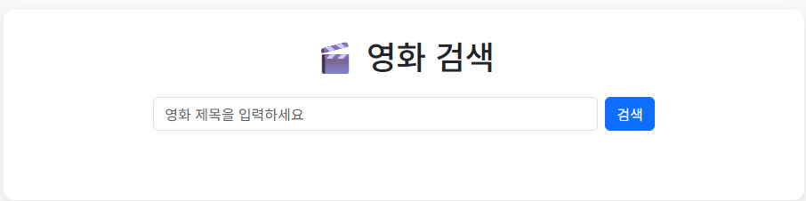
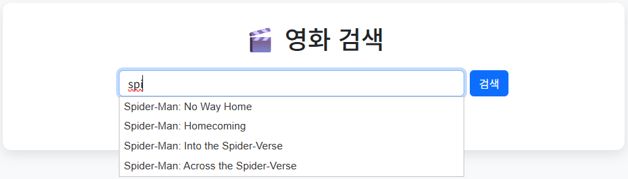
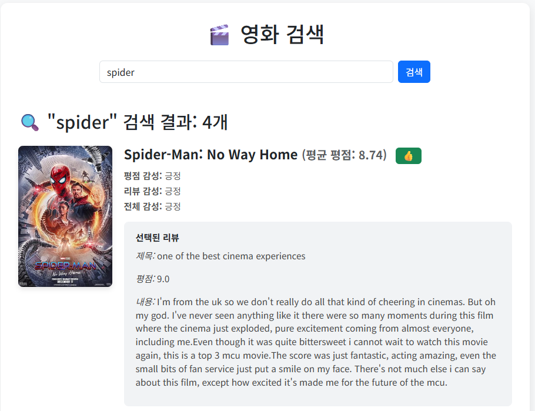

# MOVIE_RECOMMEND

## 프로젝트 개요
이 프로젝트는 영화 리뷰 데이터를 기반으로 영화별 평점과 리뷰 감정을 분석하여 사용자에게 맞춤형 추천 정보를 제공하는 시스템입니다.

---

## 기술 스택
- **Frontend:** HTML, CSS, JavaScript
- **Backend:** Django
- **Database:** MySQL
- **Data Processing:** Hadoop (HDFS, MapReduce)
- **Data Source:** [Kaggle 영화 리뷰 데이터셋](https://www.kaggle.com/datasets/shivvm/popular-movies-imdb-reviews-dataset/data)

---

## 데이터 처리 과정
1. **HDFS 업로드**
   - Kaggle CSV 파일을 HDFS의 `movie_data` 디렉토리에 업로드하여 클러스터에 분산 저장

2. **MapReduce 처리**
   - **Mapper:** 각 노드에서 영화 목록과 리뷰 목록을 구분하고, 영화 ID를 키로 데이터를 변환
   - **Shuffle & Sort:** 동일한 영화 ID를 가진 레코드를 정렬하여 하나의 Reducer로 전달
   - **Reducer:** 
     - 영화 제목, 평점, 리뷰 내용을 수집하고 평균 평점을 계산
     - 리뷰 텍스트 기반 감정 분석 수행
     - 평점 감정과 결합하여 최종 종합 감정 결정
     - 최종 결과를 CSV 형식으로 출력하고 `movie_output`에 저장

3. **리뷰 감정 분석**
   - 긍정 키워드(`good`, `great`, `love` 등) 등장 시 점수 `+`
   - 부정 키워드(`bad`, `boring`, `hate` 등) 등장 시 점수 `-`
   - 최종 점수 기준으로 리뷰를 `'긍정'`, `'부정'`, `'평범'`으로 분류
   - 영화별 리뷰 집계:
     - 긍정/부정 비율이 유사하면 `'호불호'`로 표시

---

## 웹 기능
1. **자동완성 검색**
   - jQuery UI Autocomplete 사용
   - 사용자의 입력을 실시간 감지
   - AJAX GET 요청으로 서버 `autocomplete_movies` 뷰 호출
   - 서버에서 MySQL `icontains` 필터로 최대 10개의 영화 제목 후보 추출
   - JSON 형태로 클라이언트에 반환 후 드롭다운 리스트로 표시

2. **추천 표시**
   - 리뷰 분석 결과를 기반으로 영화 감정 표시
   - 긍정적이면 시각적으로 강조

## 웹 화면
### 홈 화면
  
**첫 화면에서 바로 영화 검색 가능**

### 자동완성 기능
  
**검색창 입력 시 관련 영화 제목을 제안**

### 검색 결과
  
**영화 포스터, 제목, 평점, 추천 여부까지 한눈에 확인**